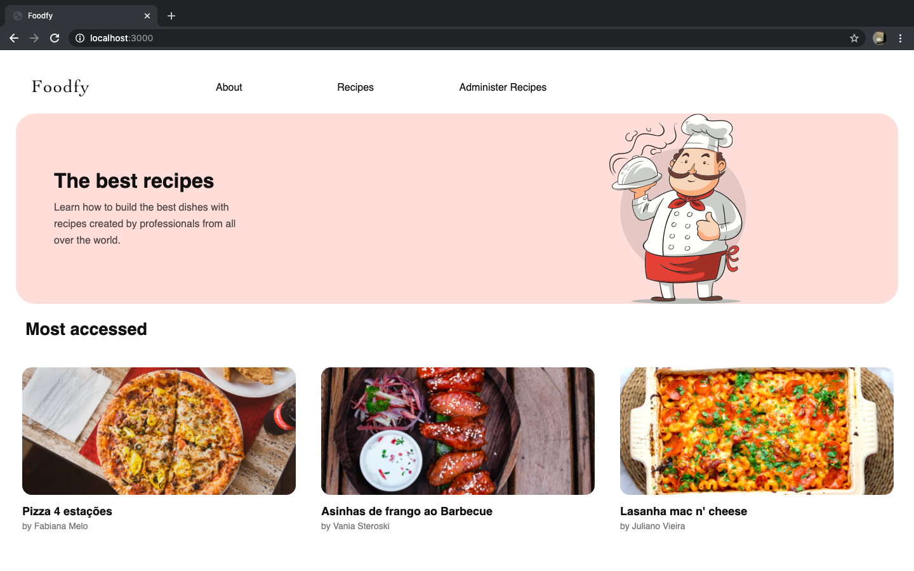
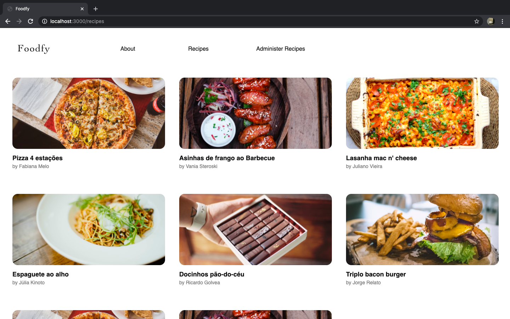
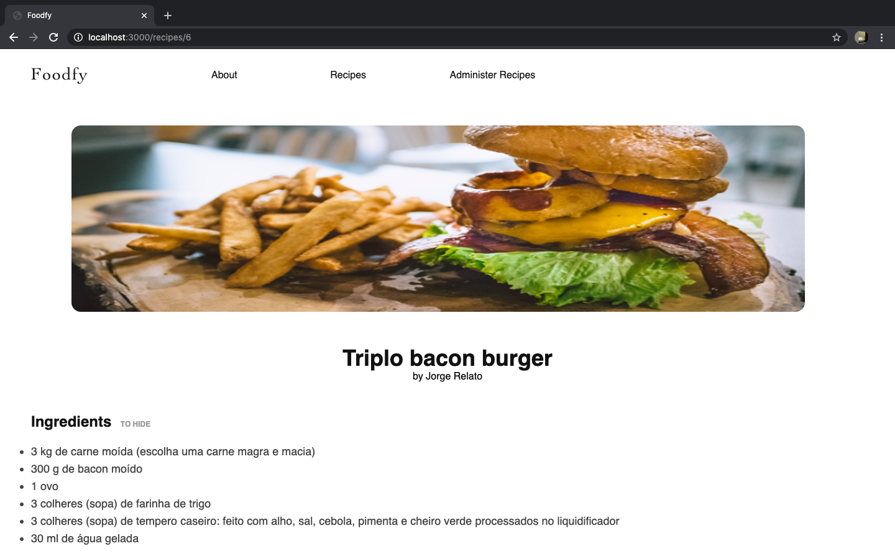
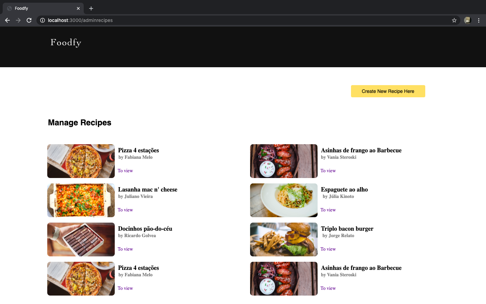
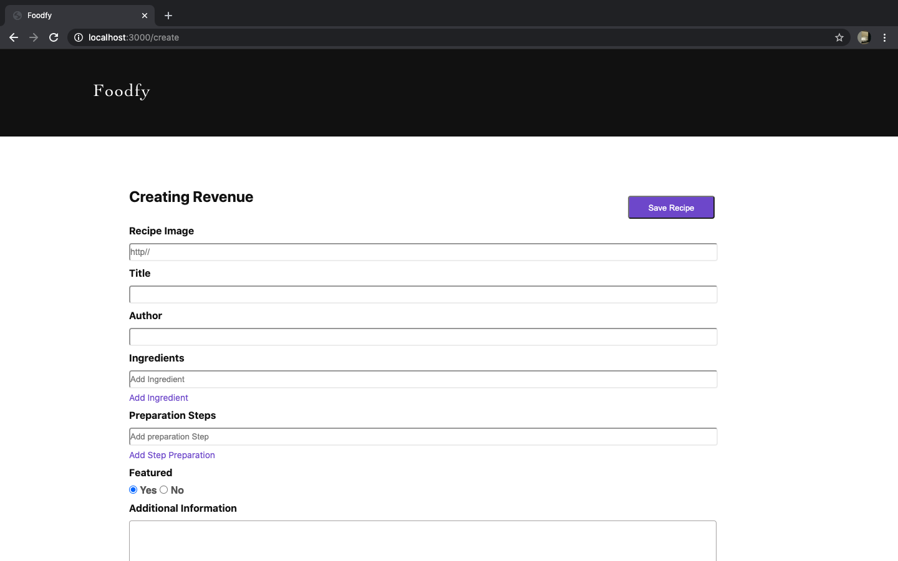
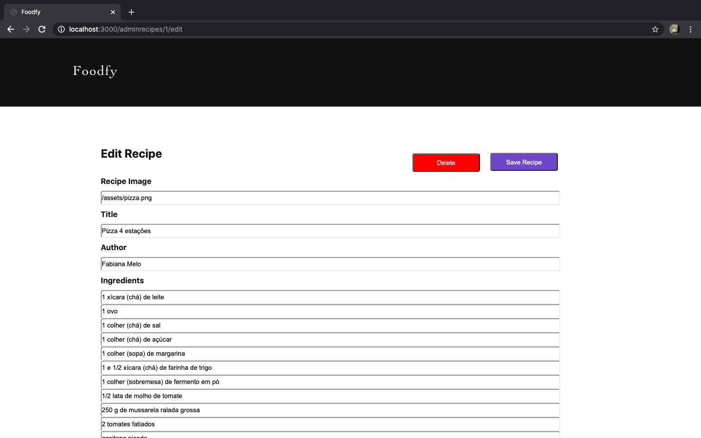

<h1 align="center">
  
<h1>

<h1 align="center">
  
  
  
  
  
  
  
</h1>

## 🔖 Sobre

O projeto **Foodfy** está sendo desenvolvido dentro do curso **LaunchBase** da escola de programação RocketSeat. O objetivo da aplicação é colocarmos em prática nossos conhecimentos adquiridos em aula desde os primeiro módulos até o final do curso. Portanto, **projeto em constante mudança**.  

---

## 💻 Tecnologias utilizadas Back-end

- [JavaScript](https://www.javascript.com/)
- [NodeJs](https://nodejs.org/en/)
- [Express](https://expressjs.com/pt-br/) 
- [Nodemon](https://www.npmjs.com/package/nodemon)
- [Browser-sync](https://www.browsersync.io/)
- [File-system](https://nodejs.org/api/fs.html#fs_file_system)

---

## 💻 Tecnologias utilizadas Web

- [HTML](https://developer.mozilla.org/en-US/docs/Web/HTML)
- [CSS](https://www.w3.org/Style/CSS/Overview.en.html)
- [Nunjucks](https://mozilla.github.io/nunjucks/)

## ⇣ Como baixar o projeto

```bash
# Clonar o repositório
$ git clone https://github.com/bernardosertorio/site-foodfy
 
# Instalar as dependências 
$ npm install

# Iniciar o projeto
$ npm start
```

---

Em desenvolvimento por 😃 Bernardo Sertório
